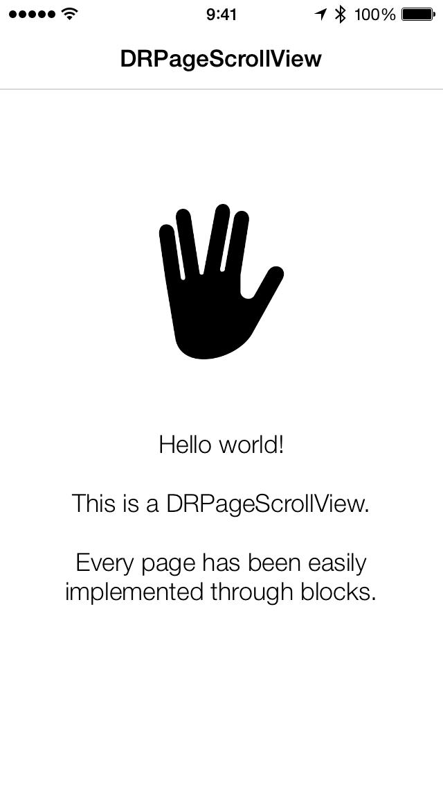

DRPageScrollView
================

<p align="center">
	
</p>

## Features

- __Block-driven__ page setup.
- __Auto Layout__ friendly.
- __Page reusability__ à la UITableView reusable cells.

## Installation

### CocoaPods

	pod 'DRPageScrollView'

### Manually

Drag and copy all files in the [__DRPageScrollView__](DRPageScrollView) folder into your project.

## At a glance

### Enabling page reusability

Enabling page reusability is ridiculously simple:

```objective-c
pageScrollView.pageReuseEnabled = YES;
```

_Note: `pageReuseEnabled` is meant to be set to the desired value before adding any pages to the page scroll view._

### Adding a page

Using Auto Layout on the subviews is not compulsory, but it's highly recommended.

For the sake of simplicity, the example below doesn't contain Auto Layout code.

```objective-c
[pageScrollView addPageWithHandler:^(UIView *pageView) {
    UIView *squareView = [UIView new];
    squareView.backgroundColor = [UIColor redColor];
    squareView.frame = CGRectMake(50, 50, 100, 100);
    
    [pageView addSubview:squareView];
}];
```

## License

`DRPageScrollView` is available under the MIT license.